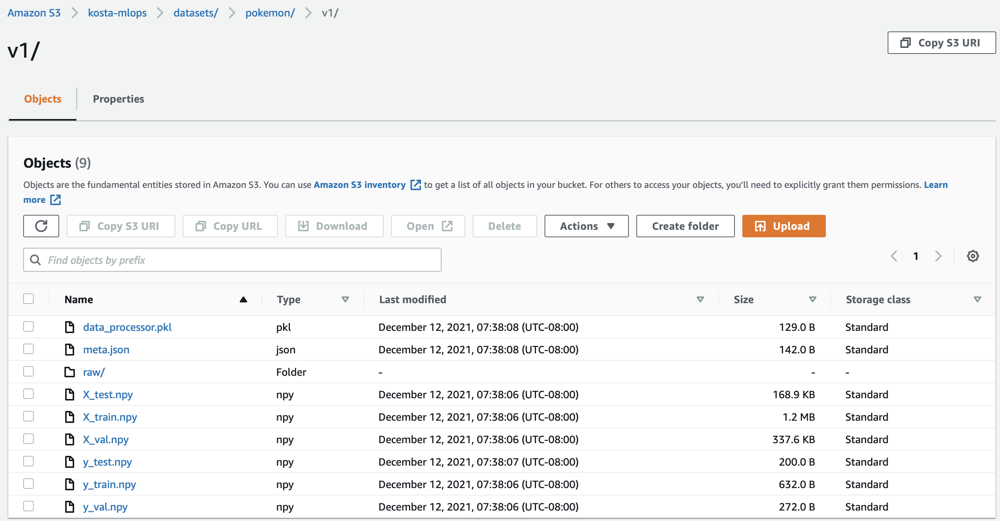
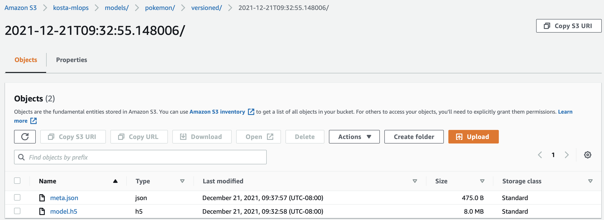

# MLOps

mlops is a package that enables software engineering within an MLOps framework by
providing:

* Seamless dataset and model versioning
* Publication of versioned datasets and models to local and Cloud filesystems
* Serialization and reproducibility of the data processing pipeline for each
versioned dataset, so that new prediction or training data can be pre- and
post-processed according to the arbitrary transformations that produced the
original dataset
* Capturing of dataset and model metadata, including the connection of models to
the datasets on which they were trained/validated/tested
* A common framework for data processing and model prototyping

## Installation

TODO update package name

```bash
pip install mlops
```

## Why does MLOps matter?

MLOps as a software engineering methodology for ML, and by extension this package that aims to enable MLOps, is
designed to improve the quality and decrease the time to market of ML systems. One key component that this package
automates, dataset and model versioning, supports arbitrary rollback to previous dataset and model combinations so that
any results the ML team has achieved can be effortlessly reproduced.

Consider the following motivating scenario. Your team creates a dataset and trains an initial ML model to 98% accuracy.
You hypothesize that you can improve the accuracy, so you experiment with many datasets and models. Over several months, your
next-best dataset/model achieve only 95% accuracy. You might have your old model saved, but you've changed the dataset
so many times that you can't reproduce the original input to your ML model. You have no idea how to put the model into
production, because no new data can be processed according to the transformations (of which you have no record) that
produced your original dataset. There may be a way to piece together the original dataset from your VCS history, but it
will be painful and costly. With dataset and model versioning, you could have avoided this situation.

## Versioned dataset artifacts

When you call `VersionedDatasetBuilder`'s `publish()`, the following files will be generated:

* `*.npy`: Tensors for training, validation, testing, and/or prediction (as defined by the user)
* `data_processor.pkl`: The serialized data processor object
* `meta.json`: Metadata, including creation time, dataset hash, and tags
* `raw`: The raw dataset, either directly copied or linked (as defined by the user)

Consider the [image classification example](mlops/examples/image/classification), in which Pokemon images are classified
by type. The following is the result of calling `publish('datasets/pokemon', version='v1')`:

```
datasets/pokemon/
└── v1
    ├── X_test.npy
    ├── X_train.npy
    ├── X_val.npy
    ├── data_processor.pkl
    ├── meta.json
    ├── raw
    │   ├── images
    │   │   ├── blastoise.png
    │   │   ├── bulbasaur.png
    │   │   ├── charizard.png
    │   │   ├── charmander.png
    │   │   ├── charmeleon.png
    │   │   ├── ivysaur.png
    │   │   ├── squirtle.png
    │   │   ├── venusaur.png
    │   │   ├── wartortle.png
    │   │   └── zapdos.png
    │   └── pokemon.csv
    ├── y_test.npy
    ├── y_train.npy
    └── y_val.npy
```

The dataset can be published to a Cloud store such as S3 by specifying a URL instead of a local path. For example, the
following is the result of calling `publish('s3://kosta-mlops/datasets/pokemon', version='v1')`:



## Versioned model artifacts

`VersionedModelBuidler`'s `publish()` creates the following files:

* `model.h5`: The saved model (the user decides whether the model is saved at the last epoch, best epoch, etc.)
* `meta.json`: Metadata, including creation time, model hash, tags, training history, hyperparameters, and a link to
the versioned dataset on which the model was trained.

Again in the [image classification example](mlops/examples/image/classification), the following is the result of
`publish('models/pokemon/versioned')`. If no explicit version is supplied, the timestamp is used as the version.

```
models/pokemon/versioned/
├── 2021-12-19T06:59:00.451852
│   ├── meta.json
│   └── model.h5
```

Publish to a Cloud store with `publish('s3://kosta-mlops/models/pokemon/versioned')`:



## Examples

See the [project examples directory](mlops/examples) for worked and tested examples.

## Quickstart

### Extend class `DataProcessor`

First, create a concrete subclass of abstract `DataProcessor` that tells
`VersionedDatasetBuilder` objects how to transform raw data files into feature
and label tensors.

You can also extend `InvertibleDataProcessor` if you want to be able to invert
preprocessing transformations. This capability helps with model input and output
interpretability, since it's not always readily apparent what the raw input and
output of a model mean to human beings.

```python
import numpy as np
from mlops.dataset.data_processor import DataProcessor


class MyDataProcessor(DataProcessor):
    """Transforms a raw dataset into features and labels for downstream model
    training, prediction, etc."""

    def get_raw_features_and_labels(self, dataset_path: str) -> \
            (dict[str, np.ndarray], dict[str, np.ndarray]):
        """Returns the raw feature and label tensors from the dataset path. This
        method is specifically used for the train/val/test sets and not input
        data for prediction, because in some cases the features and labels need
        to be read simultaneously to ensure proper ordering of features and
        labels.

        For example, when handling image data, the raw features would likely be
        tensors of shape m x h x w x c, where m is the number of images, h is
        the image height, w is the image width, and c is the number of channels
        (3 for RGB), with all values in the interval [0, 255]. The raw labels
        may be tensors of shape m, where m is the number of examples, with all
        values in the set {0, ..., k - 1} indicating the class.

        :param dataset_path: The path to the file or directory on the local or
            remote filesystem containing the dataset, specifically
            train/val/test and not prediction data.
        :return: A 2-tuple of the features dictionary and labels dictionary,
            with matching keys and ordered tensors.
        """
        # Your code here.
        pass

    def get_raw_features(self, dataset_path: str) -> dict[str, np.ndarray]:
        """Returns the raw feature tensors from the dataset path. The raw
        features are how training/validation/test as well as prediction data
        enter the data pipeline. For example, when handling image data, the raw
        features would likely be tensors of shape m x h x w x c, where m is the
        number of images, h is the image height, w is the image width, and c is
        the number of channels (3 for RGB), with all values in the interval
        [0, 255].

        :param dataset_path: The path to the file or directory on the local or
            remote filesystem containing the dataset.
        :return: A dictionary whose values are feature tensors and whose
            corresponding keys are the names by which those tensors should be
            referenced. For example, the training features (value) may be called
            'X_train' (key).
        """
        # Your code here.
        pass

    def preprocess_features(self, raw_feature_tensor: np.ndarray) -> np.ndarray:
        """Returns the preprocessed feature tensor from the raw tensor. The
        preprocessed features are how training/validation/test as well as
        prediction data are fed into downstream models. For example, when
        handling image data, the preprocessed features would likely be tensors
        of shape m x h x w x c, where m is the number of images, h is the image
        height, w is the image width, and c is the number of channels (3 for
        RGB), with all values in the interval [0, 1].

        :param raw_feature_tensor: The raw features to be preprocessed.
        :return: The preprocessed feature tensor. This tensor is ready for
            downstream model consumption.
        """
        # Your code here.
        pass

    def preprocess_labels(self, raw_label_tensor: np.ndarray) -> np.ndarray:
        """Returns the preprocessed label tensor from the raw tensor. The
        preprocessed labels are how training/validation/test as well as
        prediction data are fed into downstream models. For example, in a
        classification task, the preprocessed labels may be tensors of shape
        m x k, where m is the number of examples, and k is the number of
        classes, where each of the k-length vectors are one-hot encoded.

        :param raw_label_tensor: The raw labels to be preprocessed.
        :return: The preprocessed label tensor. This tensor is ready for
            downstream model consumption.
        """
        # Your code here.
        pass
```

### Publish a dataset

Use a `VersionedDatasetBuilder` to build and publish a dataset. You can publish the
dataset to the local filesystem or a cloud store like S3. `VersionedDatasetBuilder`
objects publish versioned datasets, which can be loaded directly from their paths.
This relationship ensures that every instantiated `VersionedDataset` object is in
the dataset repository (i.e., you can't create an "unversioned"
`VersionedDataset`).

The `VersionedDataset`
is important to model development because it standardizes the training/validation/test datasets,
providing a common point of comparison between models. It also captures the
transformations required to feed data into models using the `data_processor`
property. During publication, the `VersionedDatasetBuilder` serializes the data processor
and adds it to the dataset repository as an artifact. The serialized data
processor captures the data pre- and post-processing instructions at the time of
dataset creation, which may not be tied to any commit in the project VCS (saving
the commit at which the dataset was built is not sufficient for reproducing the
data processing pipeline). If you decide to change your data processor class
definition to output data in a new schema, previous versioned datasets still
"know" how to transform data into a format consistent with the
training/validation/test datasets through the `data_processor` property.

```python
from mlops.dataset.versioned_dataset_builder import VersionedDatasetBuilder

processor = MyDataProcessor()
builder = VersionedDatasetBuilder('path/to/my/dataset', processor)
builder.publish('s3://my-bucket/datasets', 'v1', tags=['image', 'classification'])
```

### Publish a model

Now train and publish a model using the versioned dataset and a `VersionedModelBuilder`. Every prototype model should be published so that any results achieved
can be reproduced.

The `TrainingConfig` object saves the training history and hyperparameters for
experiment tracking. Both of these items are stored in the model metadata.

```python
from tensorflow.keras.models import Sequential
from tensorflow.keras.layers import Dense
from mlops.dataset.versioned_dataset import VersionedDataset
from mlops.model.training_config import TrainingConfig
from mlops.model.versioned_model_builder import VersionedModelBuilder

versioned_dataset = VersionedDataset('s3://my-bucket/datasets/v1')
model = Sequential([Dense(versioned_dataset.y_train.shape[1],
                          input_shape=versioned_dataset.X_train.shape[1:])])
model.compile('adam', loss='mse')
train_kwargs = {'epochs': 5,
                'batch_size': 8}
history = model.fit(x=versioned_dataset.X_train,
                    y=versioned_dataset.y_train,
                    **train_kwargs)
training_config = TrainingConfig(history, train_kwargs)
builder = VersionedModelBuilder(versioned_dataset, model, training_config)
builder.publish('s3://my-bucket/models', tags=['prototype'])
```

### Predict using VersionedDataset and VersionedModel

Now that both datasets and models are versioned, use VersionedDataset and
VersionedModel objects to process new data and run prediction.

```python
from mlops.model.versioned_model import VersionedModel

versioned_model = VersionedModel(
    's3://my-bucket/models/2021-12-19T06:59:00.451852')
features = versioned_dataset.data_processor.get_preprocessed_features(
    'path/to/new/data/for/prediction')
predictions = versioned_model.model.predict(features['X_pred'])
```
